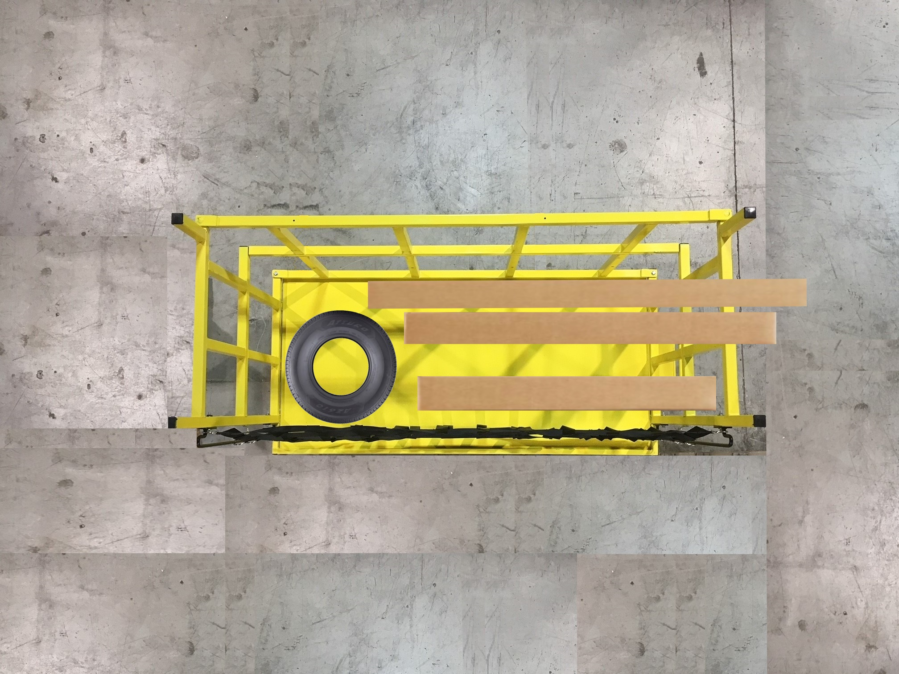
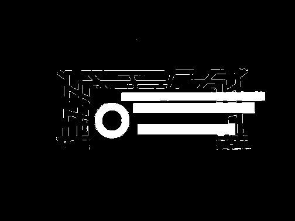
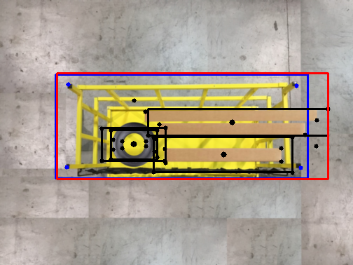

# pi-object-detection

Use a Raspberry Pi and a USB web camera for computer vision with OpenCV and TensorFlow. This should provide a good starting point of using CV in your own applications.

## Applications
Currently I have implemented the following applications:

### 1. Camera Test
Test the RPi and OpenCV environment. You are expected to see video streams from your USB camera if everything is set right.

### 2. Object Tracking (color)
Track an object based on its color (green/blue) and print its center position.

The output of the algorithm is a bounding box around the reference object detected.
Additional bounding boxes are returned for N-number of objects contained within the reference object's ROI.

## How to Run
1. Install the environment on a Raspberry Pi:
    `$sudo apt-get install libopencv-dev python-opencv` and
    `$pip install tensorflow`

2. Run scripts in the `/src` folder:
   `$python script_name.py`

3. To stop, press the `ESC` key

## Package Dependency
This project is based on the following packages:
- Python 2.7
- OpenCV 2.0
- TensorFlow

## Hardware Support
- Raspberry 1 Model B, Raspberry Pi 2, Raspberry Pi Zero and Raspberry Pi 3 (preferable)  
- Any USB camera supported by Raspberry Pi  
  - Too see a list of all supportive cameras, visit http://elinux.org/RPi_USB_Webcams
- The official camera module is **NOT** supported by this code, but you can modify the code to use it (Google Raspberry Pi Offical Camera with OpenCV). In the future I will add support.

